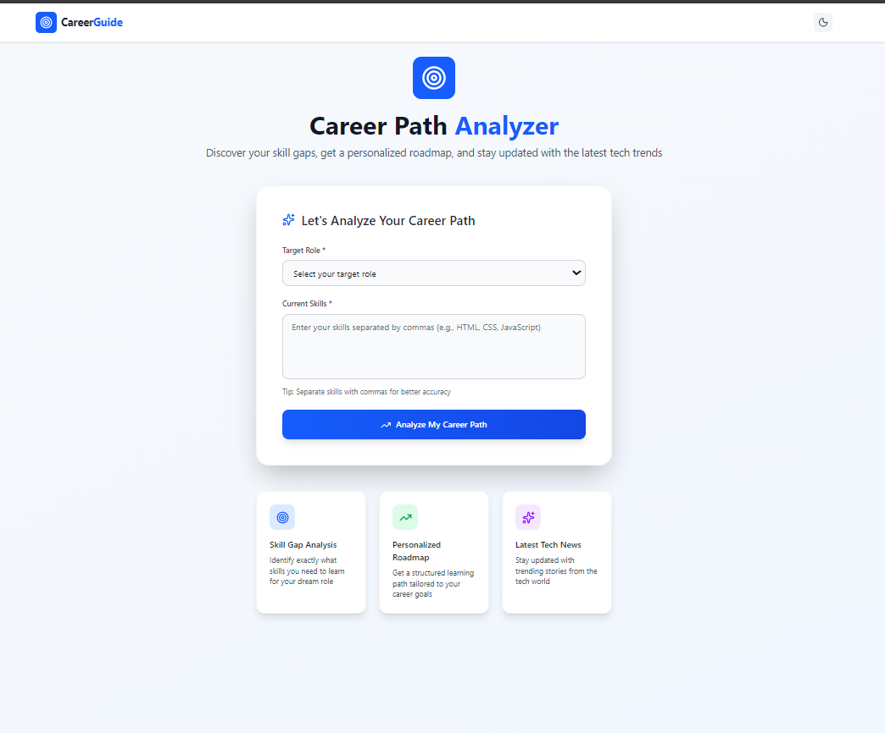
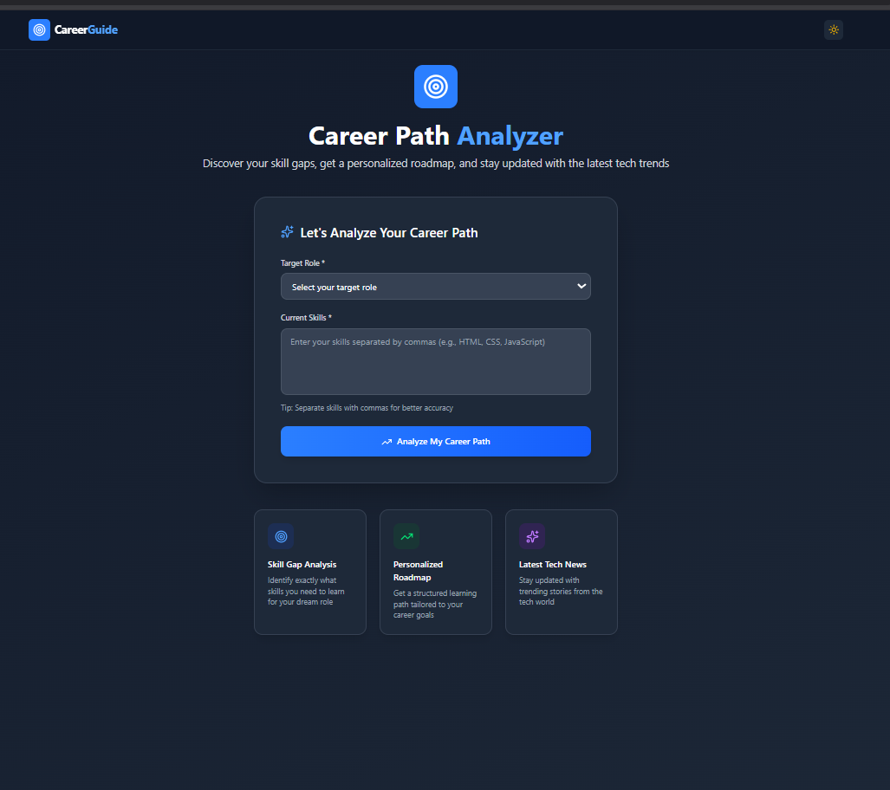
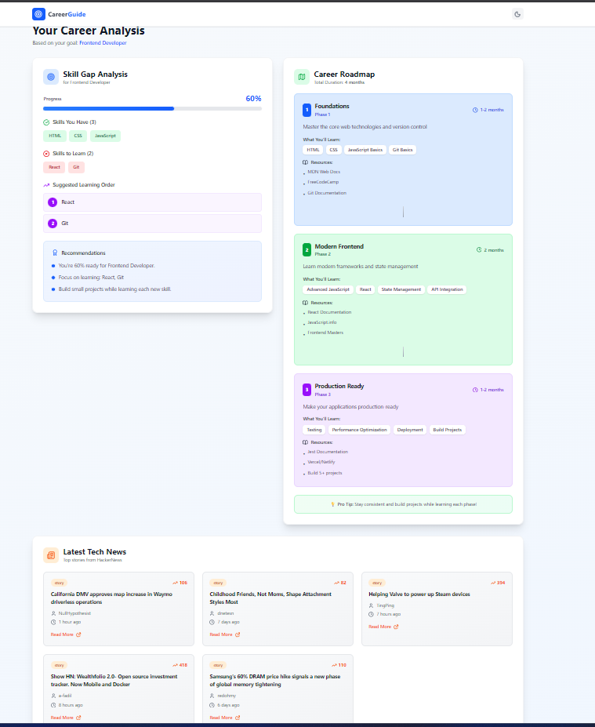
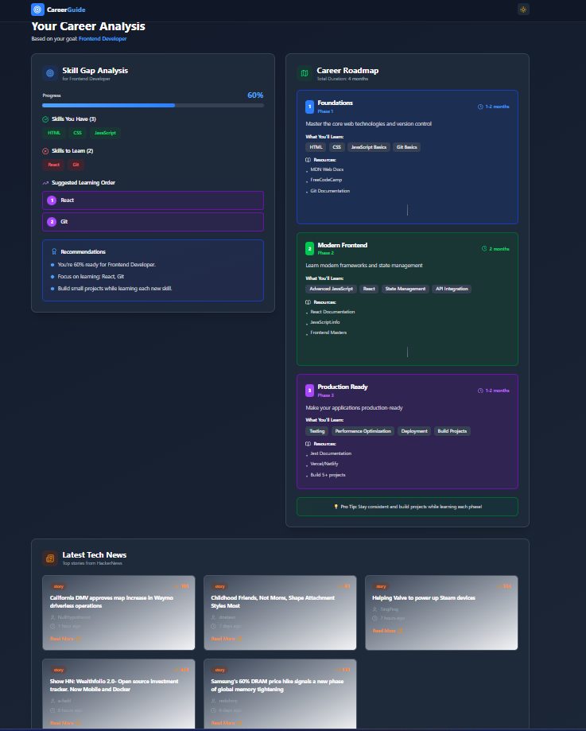

# 🚀 Career Guidance Application

A modern full-stack web application that provides intelligent skill gap analysis, personalized career roadmaps, and real-time tech news from HackerNews. Built with React, Node.js, and featuring a beautiful dark mode interface.

[](YOUR_VERCEL_URL_HERE)
[](https://reactjs.org/)
[](https://nodejs.org/)
[](https://tailwindcss.com/)

---

## 📸 Screenshots

### Home Page - Light Mode

*Career input form with role selection and skills input - Light theme with gradient background*

### Home Page - Dark Mode

*Career input form in dark mode - Elegant dark interface with smooth contrast*

### Dashboard - Light Mode

*Complete dashboard showing skill gap analysis, career roadmap, and tech news in light mode*

### Dashboard - Dark Mode

*Complete dashboard in dark mode - Professional dark theme with all features visible*

---

## 🎨 UI Showcase

| Feature | Light Mode | Dark Mode |
|---------|-----------|-----------|
| **Home Page** | Clean gradient background | Elegant dark interface |
| **Dashboard** | White cards with shadows | Dark cards with contrast |
| **Theme Toggle** | ☀️ Sun icon | 🌙 Moon icon |

### Key Visual Features:
- 🎨 **Modern Gradient Backgrounds**: Smooth color transitions
- 🌓 **Seamless Theme Switching**: One-click toggle between modes
- 📊 **Visual Progress Indicators**: Animated progress bars
- 🎯 **Color-Coded Skills**: Green for matched, Red for missing
- 📰 **Card-Based Layouts**: Clean, organized information display
- ✨ **Smooth Animations**: Hover effects and transitions

---

## ✨ Features

### 🎯 Core Functionality
- **Career Goal Input**: Intuitive form to select target role and input current skills
- **Skill Gap Analysis**: AI-powered API analysis showing:
  - Matched skills you already have
  - Missing skills to learn
  - Completion percentage with progress bar
  - Personalized recommendations
  - Prioritized learning order
- **Career Roadmap Generator**: Phase-wise learning path with:
  - 3-phase structured approach
  - Timeline estimates for each phase
  - Curated learning resources
  - Skill breakdown per phase
- **Tech News Integration**: Real-time top 5 stories from HackerNews API
  - Title, score, author, and timestamp
  - Direct links to articles
  - Formatted relative time (e.g., "2 hours ago")
- **Responsive Dashboard**: Clean, modern UI displaying all results

### 🎨 UI/UX Features
- **Dark/Light Theme Toggle** 🌓
  - Automatic system theme detection
  - Manual toggle with persistent preference
  - Smooth transitions between themes
  - localStorage-based theme memory
- **Fully Responsive Design**: Optimized for mobile, tablet, and desktop
- **Modern Aesthetics**: 
  - Beautiful gradient backgrounds
  - Glassmorphism effects
  - Smooth animations and transitions
  - Interactive hover states
- **Loading States**: Elegant loading indicators for all async operations
- **Error Handling**: User-friendly error messages and fallback UI

---

## 🛠️ Tech Stack

### Frontend
- **Framework**: React 18.x with Vite
- **Routing**: React Router v6
- **Styling**: Tailwind CSS 3.x
- **Icons**: Lucide React
- **HTTP Client**: Fetch API
- **State Management**: React Hooks (useState, useEffect, useContext)
- **Theme System**: Custom Context API with localStorage

### Backend
- **Runtime**: Node.js 18.x
- **Framework**: Express.js 4.x
- **Middleware**: CORS for cross-origin requests
- **Data Storage**: In-memory JSON objects
- **Error Handling**: Custom middleware

### External APIs
- **HackerNews API**: `https://hacker-news.firebaseio.com/v0`
  - `/topstories.json` - Top story IDs
  - `/item/{id}.json` - Story details

---

## 📁 Project Structure

```
career-guidance-app/
├── backend/
│   ├── server.js                 # Express server setup
│   ├── routes/
│   │   ├── skillGapRoutes.js     # Skill gap API routes
│   │   └── roadmapRoutes.js      # Roadmap API routes
│   ├── controllers/
│   │   ├── skillGapController.js # Skill analysis logic
│   │   └── roadmapController.js  # Roadmap generation logic
│   ├── data/
│   │   ├── skillsData.js         # Predefined skills database
│   │   └── roadmapData.js        # Career roadmap templates
│   ├── package.json
│   └── .env
│
└── frontend/
    ├── src/
    │   ├── components/
    │   │   ├── Navbar.jsx         # Navigation with theme toggle
    │   │   ├── SkillGapCard.jsx   # Skill analysis display
    │   │   ├── RoadmapCard.jsx    # Roadmap visualization
    │   │   └── TechNewsCard.jsx   # HackerNews integration
    │   ├── pages/
    │   │   ├── HomePage.jsx       # Career input form
    │   │   └── DashboardPage.jsx  # Analysis results
    │   ├── services/
    │   │   ├── api.js             # Backend API calls
    │   │   └── hackerNewsApi.js   # HackerNews integration
    │   ├── context/
    │   │   └── ThemeContext.jsx   # Dark/Light theme manager
    │   ├── App.jsx                # Main app component
    │   ├── main.jsx               # App entry point
    │   └── index.css              # Global styles
    ├── assets/
    │   ├── Homepage_light_mode.png
    │   ├── Homepage_dark_mode.png
    │   ├── dashboard_light_mode.png
    │   └── dashboard_dark_mode.png
    ├── index.html
    ├── package.json
    ├── vite.config.js
    ├── tailwind.config.js         # Tailwind with dark mode
    └── postcss.config.js
```

---

## 🔧 Installation & Setup

### Prerequisites
- Node.js (v18 or higher)
- npm or yarn
- Git

### 1️⃣ Clone the Repository

```bash
git clone <your-repository-url>
cd career-guidance-app
```

### 2️⃣ Backend Setup

```bash
# Navigate to backend directory
cd backend

# Install dependencies
npm install

# Create .env file (optional)
echo "PORT=5000" > .env

# Start the server
npm run dev
```

**Backend runs on**: `http://localhost:5000`

### 3️⃣ Frontend Setup

```bash
# Navigate to frontend directory (from root)
cd frontend

# Install dependencies
npm install

# Create .env file
echo "VITE_API_URL=http://localhost:5000/api" > .env

# Start development server
npm run dev
```

**Frontend runs on**: `http://localhost:5173`

### 4️⃣ Access the Application

Open your browser and navigate to: `http://localhost:5173`

---

## 📡 API Documentation

### Base URL
```
Development: http://localhost:5000/api
Production: https://your-api-domain.onrender.com/api
```

### 1. Health Check
**Endpoint**: `GET /`

**Response**:
```json
{
  "message": "Career Guidance API is running"
}
```

### 2. Skill Gap Analysis
**Endpoint**: `POST /api/skill-gap`

**Request Headers**:
```
Content-Type: application/json
```

**Request Body**:
```json
{
  "targetRole": "Frontend Developer",
  "currentSkills": ["HTML", "CSS", "JavaScript"]
}
```

**Success Response** (200 OK):
```json
{
  "targetRole": "Frontend Developer",
  "totalRequiredSkills": 5,
  "completionPercentage": 60,
  "matchedSkills": ["HTML", "CSS", "JavaScript"],
  "missingSkills": ["React", "Git"],
  "recommendations": [
    "You're 60% ready for Frontend Developer.",
    "Focus on learning: React, Git",
    "Build small projects while learning each new skill."
  ],
  "suggestedLearningOrder": ["React", "Git"]
}
```

**Error Response** (400 Bad Request):
```json
{
  "error": "Target role and current skills are required"
}
```

**Error Response** (404 Not Found):
```json
{
  "error": "Target role not found",
  "availableRoles": ["Frontend Developer", "Backend Developer", "Data Analyst"]
}
```

### 3. Career Roadmap Generation
**Endpoint**: `POST /api/roadmap`

**Request Headers**:
```
Content-Type: application/json
```

**Request Body**:
```json
{
  "targetRole": "Backend Developer"
}
```

**Success Response** (200 OK):
```json
{
  "targetRole": "Backend Developer",
  "roadmap": [
    {
      "phase": "Phase 1",
      "duration": "1-2 months",
      "title": "Programming Fundamentals",
      "skills": ["Java Basics", "OOP Concepts", "Git", "Data Structures"],
      "description": "Build strong programming foundations",
      "resources": [
        "Java Documentation",
        "Head First Java",
        "Git Basics"
      ]
    },
    {
      "phase": "Phase 2",
      "duration": "2 months",
      "title": "Backend Development",
      "skills": ["Spring Boot", "SQL & Databases", "REST APIs", "Authentication"],
      "description": "Master backend frameworks and database management",
      "resources": [
        "Spring Boot Docs",
        "PostgreSQL Tutorial",
        "REST API Design"
      ]
    },
    {
      "phase": "Phase 3",
      "duration": "1-2 months",
      "title": "Advanced & Deployment",
      "skills": ["Microservices", "Docker", "Cloud Deployment", "System Design"],
      "description": "Learn deployment and system architecture",
      "resources": [
        "Docker Documentation",
        "AWS/Azure Basics",
        "System Design Primer"
      ]
    }
  ],
  "totalDuration": 5,
  "estimatedCompletion": "5 months"
}
```

**Error Response** (400 Bad Request):
```json
{
  "error": "Target role is required"
}
```

---

## 🎨 Features Walkthrough

### 1. Home Page
- **Hero Section**: Eye-catching introduction with gradient design
- **Input Form**:
  - Dropdown for target role selection
  - Textarea for comma-separated skills
  - Form validation before submission
- **Feature Cards**: Three cards highlighting key features
- **Theme Toggle**: Sun/Moon icon in navigation bar

### 2. Dashboard
- **Header**: Back button and career goal display
- **Left Panel**: Skill Gap Analysis
  - Completion percentage with animated progress bar
  - Green badges for matched skills
  - Red badges for missing skills
  - Numbered learning order
  - Personalized recommendations
- **Right Panel**: Career Roadmap
  - Color-coded phases (Blue → Green → Purple)
  - Duration estimates
  - Skill breakdown per phase
  - Learning resources
  - Visual connectors between phases
- **Bottom Section**: Latest Tech News
  - Grid layout of news cards
  - Story score and metadata
  - Direct links to articles
  - Formatted timestamps

### 3. Dark Mode
- **Toggle Location**: Moon/Sun icon in top-right navbar
- **Behavior**:
  - Click to manually switch themes
  - Automatically detects system preference on first visit
  - Saves preference to localStorage
  - Persists across page refreshes
- **Theme Colors**:
  - **Light**: White cards, gray text, blue accents
  - **Dark**: Dark gray cards, white text, lighter accents

---

## 🌍 Environment Variables

### Backend `.env`
```env
PORT=5000
NODE_ENV=development
```

### Frontend `.env`
```env
# Development
VITE_API_URL=http://localhost:5000/api

# Production
VITE_API_URL=https://your-backend-api.onrender.com/api
```

---

## 🚀 Deployment

This project uses **Render** for backend and **Vercel** for frontend deployment.

### Backend Deployment on Render

#### Step 1: Prepare Backend for Render

1. **Ensure your backend has the correct start script** in `backend/package.json`:
```json
{
  "scripts": {
    "start": "node server.js",
    "dev": "nodemon server.js"
  }
}
```

2. **Update CORS settings** in `backend/server.js` for production:
```javascript
const cors = require('cors');

// Allow requests from your frontend domain
app.use(cors({
  origin: ['https://your-frontend.vercel.app', 'http://localhost:3000'],
  credentials: true
}));
```

#### Step 2: Deploy to Render

1. **Create account** at [render.com](https://render.com)

2. **Create New Web Service**
   - Click "New +" → "Web Service"
   - Connect your GitHub repository
   - Select your repository

3. **Configure Service**
   - **Name**: `career-guidance-backend` (or your choice)
   - **Region**: Choose closest to your users
   - **Branch**: `main` (or your default branch)
   - **Root Directory**: `backend`
   - **Runtime**: `Node`
   - **Build Command**: `npm install`
   - **Start Command**: `npm start`

4. **Environment Variables** (if needed)
   - Add `PORT` → Render auto-assigns (optional)
   - Add `NODE_ENV` → `production`

5. **Choose Plan**
   - Free tier is sufficient for assignment/demo
   - Click "Create Web Service"

6. **Wait for Deployment**
   - Render will build and deploy automatically
   - You'll get a URL like: `https://career-guidance-backend.onrender.com`
   - ⚠️ **Note**: Free tier may have cold starts (first request takes 30-60 seconds)

#### Step 3: Test Backend

```bash
# Test health endpoint
curl https://your-backend-url.onrender.com

# Expected response:
# {"message": "Career Guidance API is running"}
```

---

### Frontend Deployment on Vercel

#### Step 1: Prepare Frontend

1. **Update `.env` file** in `frontend/.env`:
```env
# Replace with your Render backend URL
VITE_API_URL=https://your-backend-url.onrender.com/api
```

2. **Test build locally**:
```bash
cd frontend
npm run build
npm run preview
```

#### Step 2: Deploy to Vercel

**Method 1: Vercel CLI (Recommended)**

1. **Install Vercel CLI**:
```bash
npm install -g vercel
```

2. **Deploy**:
```bash
cd frontend
vercel
```

3. **Follow prompts**:
   - Login to Vercel
   - Set up project name
   - Choose settings (use defaults)
   - Deploy!

4. **Set Environment Variables**:
```bash
vercel env add VITE_API_URL production
# Enter your Render backend URL when prompted
```

5. **Redeploy with environment variable**:
```bash
vercel --prod
```

**Method 2: Vercel Dashboard (Easier)**

1. **Go to** [vercel.com](https://vercel.com)
2. **Import Project**:
   - Click "Add New" → "Project"
   - Import your GitHub repository
   - Select the repository
3. **Configure Project**:
   - **Framework Preset**: Vite
   - **Root Directory**: `frontend`
   - **Build Command**: `npm run build`
   - **Output Directory**: `dist`
4. **Environment Variables**:
   - Add `VITE_API_URL` → `https://your-backend-url.onrender.com/api`
5. **Deploy**:
   - Click "Deploy"
   - Wait for build to complete
   - You'll get a URL like: `https://career-guidance-app.vercel.app`

---

### Post-Deployment Checklist

#### 1. Update CORS on Backend
After getting your Vercel URL, update backend CORS:

```javascript
// backend/server.js
app.use(cors({
  origin: [
    'https://your-frontend.vercel.app', // Replace with actual URL
    'http://localhost:3000'              // Keep for local development
  ],
  credentials: true
}));
```

Commit and push changes - Render will auto-redeploy.

#### 2. Test All Features

Test these endpoints from your deployed frontend:

- [ ] Home page loads correctly
- [ ] Form submission works
- [ ] Skill gap analysis displays
- [ ] Roadmap generates correctly  
- [ ] HackerNews feeds load
- [ ] Theme toggle works
- [ ] Navigation functions
- [ ] Mobile responsive

#### 3. Test API Directly

```bash
# Test skill gap endpoint
curl -X POST https://your-backend-url.onrender.com/api/skill-gap \
  -H "Content-Type: application/json" \
  -d '{"targetRole":"Frontend Developer","currentSkills":["HTML","CSS"]}'

# Test roadmap endpoint  
curl -X POST https://your-backend-url.onrender.com/api/roadmap \
  -H "Content-Type: application/json" \
  -d '{"targetRole":"Backend Developer"}'
```


### Troubleshooting

#### Backend Issues

**Problem**: CORS errors in browser console
```
Solution: Update CORS origin in backend/server.js with exact Vercel URL
```

**Problem**: Backend not responding
```
Solution: Check Render logs, may need to wait for cold start
```

**Problem**: 404 errors on API routes
```
Solution: Verify VITE_API_URL includes /api suffix
```

#### Frontend Issues

**Problem**: Environment variables not working
```
Solution: Ensure variable starts with VITE_ prefix
Solution: Redeploy after adding environment variables
```

**Problem**: Build fails on Vercel
```
Solution: Check build command is "npm run build"
Solution: Verify all dependencies are in package.json
```

**Problem**: API calls fail in production
```
Solution: Check Network tab for actual error
Solution: Verify backend URL in environment variables
```

---

### Continuous Deployment

Both platforms support automatic deployments:

**Render**:
- Automatically deploys on push to main branch
- Configure in Settings → Build & Deploy

**Vercel**:  
- Automatically deploys on push to main branch
- Preview deployments for pull requests
- Configure in Project Settings → Git

---


## 📄 License

This project is licensed under the MIT License - see the LICENSE file for details.

---

## 👨‍💻 Author

**Your Name**
- GitHub: [@myusername](https://github.com/vikramsingh-786)
- LinkedIn: [My Profile](https://www.linkedin.com/in/vikram-singh-508b08250/)
- Email: becomerdeveloper@gmail

---

## 🙏 Acknowledgments

- **CodeAtRandom AI** - Assignment project
- **HackerNews** - Tech news API
- **Tailwind CSS** - Utility-first CSS framework
- **Lucide** - Beautiful icon set
- **React Community** - Excellent documentation
- **Vite** - Lightning-fast build tool

---

## 📞 Support

For questions or issues:
1. Check the documentation above
2. Open an issue on GitHub
3. Contact via email

---

## 🎓 Project Context

This project was built as part of the **CodeAtRandom AI Full Stack Developer Assignment** to demonstrate:
- Full-stack development skills
- React and Node.js expertise
- API design and integration
- Modern UI/UX practices
- Clean code architecture
- Problem-solving abilities

---

**Built with ❤️ using React, Node.js, and Tailwind CSS**

**⭐ Star this repo if you found it helpful!**
